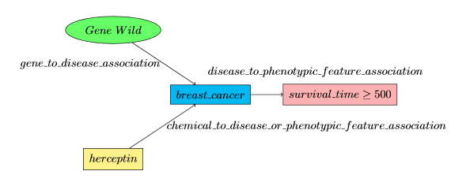

# Table of Contents
- [Introduction](#introduction)
- [Requirements](#requirements)
  - [Optional libraries](#optional-libraries)
- [Installation](#installation)
- [Quick Start](#quick-start)
- [Building Supported Queries](#building-supported-chp-queries)
  - [Standard Queries](#standard-probablistic-query-one-query-one-result)
    - [Single Gene Queries](#single-gene-queries)
    - [Multiple Gene Queries](#multi-gene-queries)
  - [Gene Wildcard Queries](#gene-wildcard-query-one-query-many-results)
  - [Drug Wildcard Queries](#drug-wildcard-query-one-query-many-results)
- [CHP Query Semantics](#chp-query-semantics)
- [API Documentation](#api-documentation)

# Introduction
The *chp_client* is a lightweight Python client for the NCATS Connections Hypothesis Provider (CHP). It is meant to be an easy-to-use wrapper utility to both run and build TRAPI queries the CHP web service will understand. Many of the CHP queries have been inspired by direct input from Translator ARAs and such ARAs may have their own dedicated CHP API client that returns results that they expect. However, there is also a default client that can handle generic CHP requests. 

# Requirements
  - Python >= 3.6
  - [requests](https://pypi.python.org/pypi/requests)
  
## Optional libraries
  - [requests_cache](https://pypi.python.org/pypi/requests-cache) *(Allows user to setup of requests caching.)*

# Installation
## Option 1
``` python3 setup.py install ```
## Option 2
```pip3 install -e git+https://github.com/di2ag/chp_client#egg=chp_client```

# Quick Start
Once you have installed the CHP client, useage is as simple as:
``` python3
In [1]: from chp_client import get_client

In [2]: default_client = get_client()
```

Now that you have an instance of the client, you can determine which query graph edge predicates are currently supported by CHP with:

```python3
In[3]: default_client.predicates()
{
  "gene": {
    "disease": [
      "gene_to_disease_association"
    ]
  },
  "chemical_substance": {
    "disease": [
      "chemical_to_disease_or_phenotypic_feature_association"
    ]
  },
  "disease": {
    "phenotypic_feature": [
      "disease_to_phenotypic_feature_association"
    ]
  }
}
```

And you can check the supported curies by:

```python3
In [4]: default_client.curies()
{
  "chemical_substance": [
    {
      "name": "ZOLADEX",
      "curie": "CHEMBL:CHEMBL1201247"
    },
    {
      "name": "CYCLOPHOSPHAMIDE",
      "curie": "CHEMBL:CHEMBL88"
    }, ...
  ]
  "phenotypic_feature": [
    {
      "name": "survival_time",
      "curie": "EFO:0000714"
    }
  ],
  "disease": [
    {
      "name": "breast_cancer",
      "curie": "MONDO:0007254"
    }
  ],
  "gene": [
    {
      "name": "CLIP2",
      "curie": "ENSEMBL:ENSG00000106665"
    },
    {
      "name": "PI4KA",
      "curie": "ENSEMBL:ENSG00000241973"
    },
    {
      "name": "CELSR2",
      "curie": "ENSEMBL:ENSG00000143126"
    }, ...
  ]
}
```
This function will return a dictionary of supported biolink entities (NamedThings) that are supported by CHP along with a list of curies for each type. The list will include both our internal CHP name for the entity along with its associated curie for better human readability. *Note: When building query graphs only specify the appropriate curie. There is no need to also specify our internal name that we provide.*

Now that we know which curies and predicates are supported by CHP we can post a query to CHP via:

```python3
In [5]: default_client.query(q)
```
In the next section we will look at how to build CHP queries.

# Building Supported CHP Queries
As CHP is TRAPI compliant a large subset of queries can be built with a wide variety of structures. In order to scope the query building problem, we have currently limited the structures of queries that can be asked and have detailed their respective semantics. *Note: As the Translator and Biolink models develop we intend to ease these restrictions.*

## Standard Probablistic Query (One query, one result)
### Single Gene Queries
Our standard query is a straight probabilistic query of the form *P(Outcome | Gene Mutations, Disease, Therapeutics, ...)*. We can see a graphical representation of a query below:


Notice, that the CHP is inherently a multi-hop knowledge provider. We reason in the full contents of the query graph and return the appropriate response. In this case the respose will be a edge binding to the disease_to_phenotypic_feature_association in this query graph. Where the resultant calculated knowledge graph of this query graph will have a *has_confidence* attribute denoting the calculated probability for this query. We can build this query with the provided query module of the client with the following code:

```python
In [6]: from chp_client.query import build_query

In [7]: q = build_query(
   ...: genes=['ENSEMBL:ENSG00000132155'],
   ...: therapeutic='CHEMBL:CHEMBL1201585',
   ...: disease='MONDO:0007254',
   ...: outcome=('EFO:0000714', '>=', 500)
   )
   
In [8]: response = client.query(q)
```

An example response from this type of query graph is below:

```json
{
  "message": {
    "query_graph": {
      "edges": {
        "e0": {
          "type": "gene_to_disease_association",
          "source_id": "n0",
          "target_id": "n2"
        },
        "e1": {
          "type": "chemical_to_disease_or_phenotypic_feature_association",
          "source_id": "n1",
          "target_id": "n2"
        },
        "e2": {
          "type": "disease_to_phenotypic_feature_association",
          "source_id": "n2",
          "target_id": "n3",
          "properties": {
            "qualifier": ">=",
            "value": 500
          }
        }
      },
      "nodes": {
        "n0": {
          "type": "gene",
          "curie": "ENSEMBL:ENSG00000132155"
        },
        "n1": {
          "type": "chemical_substance",
          "curie": "CHEMBL:CHEMBL1201585"
        },
        "n2": {
          "type": "disease",
          "curie": "MONDO:0007254"
        },
        "n3": {
          "type": "phenotypic_feature",
          "curie": "EFO:0000714"
        }
      }
    },
    "knowledge_graph": {
      "edges": {
        "kge0": {
          "type": "gene_to_disease_association",
          "source_id": "ENSEMBL:ENSG00000132155",
          "target_id": "MONDO:0007254"
        },
        "kge1": {
          "type": "chemical_to_disease_or_phenotypic_feature_association",
          "source_id": "CHEMBL:CHEMBL1201585",
          "target_id": "MONDO:0007254"
        },
        "kge2": {
          "type": "disease_to_phenotypic_feature_association",
          "source_id": "MONDO:0007254",
          "target_id": "EFO:0000714",
          "properties": {
            "qualifier": ">=",
            "value": 500
          },
          "has_confidence_level": 1.0
        }
      },
      "nodes": {
        "ENSEMBL:ENSG00000132155": {
          "type": "gene",
          "name": "RAF1"
        },
        "CHEMBL:CHEMBL1201585": {
          "type": "chemical_substance",
          "name": "TRASTUZUMAB"
        },
        "MONDO:0007254": {
          "type": "disease"
        },
        "EFO:0000714": {
          "type": "phenotypic_feature"
        }
      }
    },
    "results": [
      {
        "node_bindings": {
          "n0": {
            "kg_id": "ENSEMBL:ENSG00000132155"
          },
          "n1": {
            "kg_id": "CHEMBL:CHEMBL1201585"
          },
          "n2": {
            "kg_id": "MONDO:0007254"
          },
          "n3": {
            "kg_id": "EFO:0000714"
          }
        },
        "edge_bindings": {
          "e0": {
            "kg_id": "kge0"
          },
          "e1": {
            "kg_id": "kge1"
          },
          "e2": {
            "kg_id": "kge2"
          }
        }
      }
    ]
  }
}

```

#### Extracting Query Probability
You can extract the probability of the query manually from the TRAPI response data from CHP, but we have also provided a helper method inside the client to assist in extracting this probability.

```python
In [9]: client.get_outcome_prob(response)
Out[9]: 1.0
```

The interpretation of this probability is that all patients in our dataset with a somatic mutation in RAF1 gene that took herceptin survived for more than 500 days after initial diagnosis.

### Multi-Gene Queries
As the CHP is inherenly multi-hop, we can easily add multiple genes to our query graph and calcuate the probability of a patient outcome in the presence of multiple gene mutations. A sample query graph is below *(We have not graphed the edge labels for ease of view but they are there in the query graph)*:


A result from the CHP will again be a single edge binding as in the single gene case with the associated probability of the query in the *has_confidence_level* attribute. We can also use our *build_query* function instead the CHP client's query module to build a Multi-Gene query. Example code for building the above query is:

```python
In [10]: q = build_query(
   ...: genes=['ENSEMBL:ENSG00000132155', 'ENSEMBL:ENSG00000196557', 'ENSEMBL:ENSG00000141510'],
   ...: therapeutic='CHEMBL:CHEMBL1201585',
   ...: disease='MONDO:0007254',
   ...: outcome=('EFO:0000714', '>=', 500)
   )
   
In [11]: response = client.query(q)
```

A sample json response from this multi-gene query is below:

```json
{
  "message": {
    "query_graph": {
      "edges": {
        "e0": {
          "type": "gene_to_disease_association",
          "source_id": "n0",
          "target_id": "n4"
        },
        "e1": {
          "type": "gene_to_disease_association",
          "source_id": "n1",
          "target_id": "n4"
        },
        "e2": {
          "type": "gene_to_disease_association",
          "source_id": "n2",
          "target_id": "n4"
        },
        "e3": {
          "type": "chemical_to_disease_or_phenotypic_feature_association",
          "source_id": "n3",
          "target_id": "n4"
        },
        "e4": {
          "type": "disease_to_phenotypic_feature_association",
          "source_id": "n4",
          "target_id": "n5",
          "properties": {
            "qualifier": ">=",
            "value": 500
          }
        }
      },
      "nodes": {
        "n0": {
          "type": "gene",
          "curie": "ENSEMBL:ENSG00000132155"
        },
        "n1": {
          "type": "gene",
          "curie": "ENSEMBL:ENSG00000196557"
        },
        "n2": {
          "type": "gene",
          "curie": "ENSEMBL:ENSG00000141510"
        },
        "n3": {
          "type": "chemical_substance",
          "curie": "CHEMBL:CHEMBL1201585"
        },
        "n4": {
          "type": "disease",
          "curie": "MONDO:0007254"
        },
        "n5": {
          "type": "phenotypic_feature",
          "curie": "EFO:0000714"
        }
      }
    },
    "knowledge_graph": {
      "edges": {
        "kge0": {
          "type": "gene_to_disease_association",
          "source_id": "ENSEMBL:ENSG00000132155",
          "target_id": "MONDO:0007254"
        },
        "kge1": {
          "type": "gene_to_disease_association",
          "source_id": "ENSEMBL:ENSG00000196557",
          "target_id": "MONDO:0007254"
        },
        "kge2": {
          "type": "gene_to_disease_association",
          "source_id": "ENSEMBL:ENSG00000141510",
          "target_id": "MONDO:0007254"
        },
        "kge3": {
          "type": "chemical_to_disease_or_phenotypic_feature_association",
          "source_id": "CHEMBL:CHEMBL1201585",
          "target_id": "MONDO:0007254"
        },
        "kge4": {
          "type": "disease_to_phenotypic_feature_association",
          "source_id": "MONDO:0007254",
          "target_id": "EFO:0000714",
          "properties": {
            "qualifier": ">=",
            "value": 500
          },
          "has_confidence_level": -1
        }
      },
      "nodes": {
        "ENSEMBL:ENSG00000132155": {
          "type": "gene",
          "name": "RAF1"
        },
        "ENSEMBL:ENSG00000196557": {
          "type": "gene",
          "name": "CACNA1H"
        },
        "ENSEMBL:ENSG00000141510": {
          "type": "gene",
          "name": "TP53"
        },
        "CHEMBL:CHEMBL1201585": {
          "type": "chemical_substance",
          "name": "TRASTUZUMAB"
        },
        "MONDO:0007254": {
          "type": "disease"
        },
        "EFO:0000714": {
          "type": "phenotypic_feature"
        }
      }
    },
    "results": [
      {
        "node_bindings": {
          "n0": {
            "kg_id": "ENSEMBL:ENSG00000132155"
          },
          "n1": {
            "kg_id": "ENSEMBL:ENSG00000196557"
          },
          "n2": {
            "kg_id": "ENSEMBL:ENSG00000141510"
          },
          "n3": {
            "kg_id": "CHEMBL:CHEMBL1201585"
          },
          "n4": {
            "kg_id": "MONDO:0007254"
          },
          "n5": {
            "kg_id": "EFO:0000714"
          }
        },
        "edge_bindings": {
          "e0": {
            "kg_id": "kge0"
          },
          "e1": {
            "kg_id": "kge1"
          },
          "e2": {
            "kg_id": "kge2"
          },
          "e3": {
            "kg_id": "kge3"
          },
          "e4": {
            "kg_id": "kge4"
          }
        }
      }
    ]
  }
}
```

#### Extracting Query Probability
You can extract the probability of the query manually from the TRAPI response data from CHP the same way as for a single gene query, as well as using the *get_outcome_prob* function as we did in the single gene query.

```python
In [12]: client.get_outcome_prob(response)
Out[12]: -1
```

**Interpreting a -1 probability result:** A -1 query probability is not an error and should not be treated as simply zero. What this value actually means is that CHP was not able to find an inference that supported all the gene and therauptic evidence with the given outcome condition. This is an inherent artifact of probabilistic incompleteness. The interpretation should instead be that there is insufficient information in our dataset/model to provide an answer to the query.

## Gene Wildcard Query (One query, many results)
CHP also has the capability to statistically rank genes based on their overall importance to a query. We call these *Gene Wildcard* queries, as the goal is to fill in the most statistically important gene into the wildcard placeholder node. A sample query graph is located below:



In this query the CHP will calculate the standard probabilistic query of the subgraph not including the gene wildcard, i.e. *P(outcome | therapuetic, disease, etc)*. We can also use the *build_query* function in the CHP client query module to build a gene wildcard query.

```python
In [13]: q = build_query(
    ...: therapeutic='CHEMBL:CHEMBL1201585',
    ...: disease='MONDO:0007254',
    ...: outcome=('EFO:0000714', '>=', 500),
    ...: num_gene_wildcards=1
    )

ln [14]: client.query(q)
```

The sample json response from this query is:

```json
{
  "message": {
    "query_graph": {
      "edges": {
        "e0": {
          "type": "gene_to_disease_association",
          "source_id": "n0",
          "target_id": "n2"
        },
        "e1": {
          "type": "chemical_to_disease_or_phenotypic_feature_association",
          "source_id": "n1",
          "target_id": "n2"
        },
        "e2": {
          "type": "disease_to_phenotypic_feature_association",
          "source_id": "n2",
          "target_id": "n3",
          "properties": {
            "qualifier": ">=",
            "value": 500
          }
        }
      },
      "nodes": {
        "n0": {
          "type": "gene"
        },
        "n1": {
          "type": "chemical_substance",
          "curie": "CHEMBL:CHEMBL1201585"
        },
        "n2": {
          "type": "disease",
          "curie": "MONDO:0007254"
        },
        "n3": {
          "type": "phenotypic_feature",
          "curie": "EFO:0000714"
        }
      }
    },
    "knowledge_graph": {
      "edges": {
        "kge0": {
          "type": "gene_to_disease_association",
          "source_id": null,
          "target_id": "MONDO:0007254"
        },
        "kge1": {
          "type": "chemical_to_disease_or_phenotypic_feature_association",
          "source_id": "CHEMBL:CHEMBL1201585",
          "target_id": "MONDO:0007254"
        },
        "kge2": {
          "type": "disease_to_phenotypic_feature_association",
          "source_id": "MONDO:0007254",
          "target_id": "EFO:0000714",
          "properties": {
            "qualifier": ">=",
            "value": 500
          },
          "has_confidence_level": 0.9
        },
        "kge4": {
          "type": "gene_to_disease_association",
          "source_id": "ENSEMBL:ENSG00000141510",
          "target_id": "MONDO:0007254",
          "weight": 0.24999999999999997
        },
        "kge5": {
          "type": "gene_to_disease_association",
          "source_id": "ENSEMBL:ENSG00000121879",
          "target_id": "MONDO:0007254",
          "weight": 0.15
        },
        "kge6": {
          "type": "gene_to_disease_association",
          "source_id": "ENSEMBL:ENSG00000155657",
          "target_id": "MONDO:0007254",
          "weight": 0.11666666666666665
        },
        "kge7": {
          "type": "gene_to_disease_association",
          "source_id": "ENSEMBL:ENSG00000145675",
          "target_id": "MONDO:0007254",
          "weight": 0.08333333333333333
        },
        "kge8": {
          "type": "gene_to_disease_association",
          "source_id": "ENSEMBL:ENSG00000102053",
          "target_id": "MONDO:0007254",
          "weight": 0.05
        },
        "kge9": {
          "type": "gene_to_disease_association",
          "source_id": "ENSEMBL:ENSG00000169064",
          "target_id": "MONDO:0007254",
          "weight": 0.05
        },
        "kge10": {
          "type": "gene_to_disease_association",
          "source_id": "ENSEMBL:ENSG00000104517",
          "target_id": "MONDO:0007254",
          "weight": 0.05
        },
        "kge11": {
          "type": "gene_to_disease_association",
          "source_id": "ENSEMBL:ENSG00000165699",
          "target_id": "MONDO:0007254",
          "weight": 0.05
        },
        "kge12": {
          "type": "gene_to_disease_association",
          "source_id": "ENSEMBL:ENSG00000159216",
          "target_id": "MONDO:0007254",
          "weight": 0.05
        },
        "kge13": {
          "type": "gene_to_disease_association",
          "source_id": "ENSEMBL:ENSG00000155093",
          "target_id": "MONDO:0007254",
          "weight": 0.05
        }
      },
      "nodes": {
        "CHEMBL:CHEMBL1201585": {
          "type": "chemical_substance",
          "name": "TRASTUZUMAB"
        },
        "MONDO:0007254": {
          "type": "disease"
        },
        "EFO:0000714": {
          "type": "phenotypic_feature"
        },
        "ENSEMBL:ENSG00000141510": {
          "type": "gene",
          "name": "TP53"
        },
        "ENSEMBL:ENSG00000121879": {
          "type": "gene",
          "name": "PIK3CA"
        },
        "ENSEMBL:ENSG00000155657": {
          "type": "gene",
          "name": "TTN"
        },
        "ENSEMBL:ENSG00000145675": {
          "type": "gene",
          "name": "PIK3R1"
        },
        "ENSEMBL:ENSG00000102053": {
          "type": "gene",
          "name": "ZC3H12B"
        },
        "ENSEMBL:ENSG00000169064": {
          "type": "gene",
          "name": "ZBBX"
        },
        "ENSEMBL:ENSG00000104517": {
          "type": "gene",
          "name": "UBR5"
        },
        "ENSEMBL:ENSG00000165699": {
          "type": "gene",
          "name": "TSC1"
        },
        "ENSEMBL:ENSG00000159216": {
          "type": "gene",
          "name": "RUNX1"
        },
        "ENSEMBL:ENSG00000155093": {
          "type": "gene",
          "name": "PTPRN2"
        }
      }
    },
    "results": [
      {
        "node_bindings": {
          "n0": {
            "kg_id": "None"
          },
          "n1": {
            "kg_id": "CHEMBL:CHEMBL1201585"
          },
          "n2": {
            "kg_id": "MONDO:0007254"
          },
          "n3": {
            "kg_id": "EFO:0000714"
          }
        },
        "edge_bindings": {
          "e0": {
            "kg_id": "kge0"
          },
          "e1": {
            "kg_id": "kge1"
          },
          "e2": {
            "kg_id": "kge2"
          }
        }
      },
      {
        "edge_bindings": {
          "e0": {
            "kg_id": "kge4"
          },
          "e1": {
            "kg_id": "kge1"
          },
          "e2": {
            "kg_id": "kge2"
          }
        },
        "node_bindings": {
          "n0": {
            "kg_id": "ENSEMBL:ENSG00000141510"
          },
          "n1": {
            "kg_id": "CHEMBL:CHEMBL1201585"
          },
          "n2": {
            "kg_id": "MONDO:0007254"
          },
          "n3": {
            "kg_id": "EFO:0000714"
          }
        }
      },
      {
        "edge_bindings": {
          "e0": {
            "kg_id": "kge5"
          },
          "e1": {
            "kg_id": "kge1"
          },
          "e2": {
            "kg_id": "kge2"
          }
        },
        "node_bindings": {
          "n0": {
            "kg_id": "ENSEMBL:ENSG00000121879"
          },
          "n1": {
            "kg_id": "CHEMBL:CHEMBL1201585"
          },
          "n2": {
            "kg_id": "MONDO:0007254"
          },
          "n3": {
            "kg_id": "EFO:0000714"
          }
        }
      },
      {
        "edge_bindings": {
          "e0": {
            "kg_id": "kge6"
          },
          "e1": {
            "kg_id": "kge1"
          },
          "e2": {
            "kg_id": "kge2"
          }
        },
        "node_bindings": {
          "n0": {
            "kg_id": "ENSEMBL:ENSG00000155657"
          },
          "n1": {
            "kg_id": "CHEMBL:CHEMBL1201585"
          },
          "n2": {
            "kg_id": "MONDO:0007254"
          },
          "n3": {
            "kg_id": "EFO:0000714"
          }
        }
      },
      {
        "edge_bindings": {
          "e0": {
            "kg_id": "kge7"
          },
          "e1": {
            "kg_id": "kge1"
          },
          "e2": {
            "kg_id": "kge2"
          }
        },
        "node_bindings": {
          "n0": {
            "kg_id": "ENSEMBL:ENSG00000145675"
          },
          "n1": {
            "kg_id": "CHEMBL:CHEMBL1201585"
          },
          "n2": {
            "kg_id": "MONDO:0007254"
          },
          "n3": {
            "kg_id": "EFO:0000714"
          }
        }
      },
      {
        "edge_bindings": {
          "e0": {
            "kg_id": "kge8"
          },
          "e1": {
            "kg_id": "kge1"
          },
          "e2": {
            "kg_id": "kge2"
          }
        },
        "node_bindings": {
          "n0": {
            "kg_id": "ENSEMBL:ENSG00000102053"
          },
          "n1": {
            "kg_id": "CHEMBL:CHEMBL1201585"
          },
          "n2": {
            "kg_id": "MONDO:0007254"
          },
          "n3": {
            "kg_id": "EFO:0000714"
          }
        }
      },
      {
        "edge_bindings": {
          "e0": {
            "kg_id": "kge9"
          },
          "e1": {
            "kg_id": "kge1"
          },
          "e2": {
            "kg_id": "kge2"
          }
        },
        "node_bindings": {
          "n0": {
            "kg_id": "ENSEMBL:ENSG00000169064"
          },
          "n1": {
            "kg_id": "CHEMBL:CHEMBL1201585"
          },
          "n2": {
            "kg_id": "MONDO:0007254"
          },
          "n3": {
            "kg_id": "EFO:0000714"
          }
        }
      },
      {
        "edge_bindings": {
          "e0": {
            "kg_id": "kge10"
          },
          "e1": {
            "kg_id": "kge1"
          },
          "e2": {
            "kg_id": "kge2"
          }
        },
        "node_bindings": {
          "n0": {
            "kg_id": "ENSEMBL:ENSG00000104517"
          },
          "n1": {
            "kg_id": "CHEMBL:CHEMBL1201585"
          },
          "n2": {
            "kg_id": "MONDO:0007254"
          },
          "n3": {
            "kg_id": "EFO:0000714"
          }
        }
      },
      {
        "edge_bindings": {
          "e0": {
            "kg_id": "kge11"
          },
          "e1": {
            "kg_id": "kge1"
          },
          "e2": {
            "kg_id": "kge2"
          }
        },
        "node_bindings": {
          "n0": {
            "kg_id": "ENSEMBL:ENSG00000165699"
          },
          "n1": {
            "kg_id": "CHEMBL:CHEMBL1201585"
          },
          "n2": {
            "kg_id": "MONDO:0007254"
          },
          "n3": {
            "kg_id": "EFO:0000714"
          }
        }
      },
      {
        "edge_bindings": {
          "e0": {
            "kg_id": "kge12"
          },
          "e1": {
            "kg_id": "kge1"
          },
          "e2": {
            "kg_id": "kge2"
          }
        },
        "node_bindings": {
          "n0": {
            "kg_id": "ENSEMBL:ENSG00000159216"
          },
          "n1": {
            "kg_id": "CHEMBL:CHEMBL1201585"
          },
          "n2": {
            "kg_id": "MONDO:0007254"
          },
          "n3": {
            "kg_id": "EFO:0000714"
          }
        }
      },
      {
        "edge_bindings": {
          "e0": {
            "kg_id": "kge13"
          },
          "e1": {
            "kg_id": "kge1"
          },
          "e2": {
            "kg_id": "kge2"
          }
        },
        "node_bindings": {
          "n0": {
            "kg_id": "ENSEMBL:ENSG00000155093"
          },
          "n1": {
            "kg_id": "CHEMBL:CHEMBL1201585"
          },
          "n2": {
            "kg_id": "MONDO:0007254"
          },
          "n3": {
            "kg_id": "EFO:0000714"
          }
        }
      }
    ]
  }
}

```
#### Extracting the Statiscally Important Genes
CHP uses a method called Contributions Analysis to analyze gene importance and thereby rank genes. When the probability of the subgraph query (i.e. everything except the gene wildcards) is calculated, it carries with it a probabilistic mass. Contribution analysis tracks the amount of mass each component in our model contributed to the total mass (i.e. that final probability value of the query subgraph). As gene mutations play a significant role in our model, we are able to track each gene mutation's contribution to the total probabillistic mass, allowing us to yield our ranked gene results. The interpretation of these ranked genes should be that they are the genes that contributed most to supporting the given query.

You can extract this information manually from the TRAPI CHP response results section. The first result will always be the standard probability query of the subgraph (not including any genes). We can extract this information with the same *get_outcome_prob* command.

```python
In [15]: client.get_outcome_prob(response)
Out[15]: 0.9
```

The next *n* results are the ranked gene graphs where the gene wildcard has been replaced by a gene instantiation by CHP, while also adding an edge weight (contributation value) to the associated *gene_to_disease_association* edge. We can further extract this ranked list of genes with the *get_ranked_wildcards* chp client helper function.

```python
In [16]: ranked = client.get_ranked_wildcards(response)

In [17]: print(json.dumps(ranked, indent=2))
{
  "gene": [
    {
      "weight": 0.24999999999999997,
      "curie": "ENSEMBL:ENSG00000141510",
      "name": "TP53"
    },
    {
      "weight": 0.15,
      "curie": "ENSEMBL:ENSG00000121879",
      "name": "PIK3CA"
    },
    {
      "weight": 0.11666666666666665,
      "curie": "ENSEMBL:ENSG00000155657",
      "name": "TTN"
    },
    {
      "weight": 0.08333333333333333,
      "curie": "ENSEMBL:ENSG00000145675",
      "name": "PIK3R1"
    },
    {
      "weight": 0.05,
      "curie": "ENSEMBL:ENSG00000102053",
      "name": "ZC3H12B"
    },
    {
      "weight": 0.05,
      "curie": "ENSEMBL:ENSG00000169064",
      "name": "ZBBX"
    },
    {
      "weight": 0.05,
      "curie": "ENSEMBL:ENSG00000104517",
      "name": "UBR5"
    },
    {
      "weight": 0.05,
      "curie": "ENSEMBL:ENSG00000165699",
      "name": "TSC1"
    },
    {
      "weight": 0.05,
      "curie": "ENSEMBL:ENSG00000159216",
      "name": "RUNX1"
    },
    {
      "weight": 0.05,
      "curie": "ENSEMBL:ENSG00000155093",
      "name": "PTPRN2"
    }
  ]
}

```

## Drug Wildcard Query (One query, many results)
We hope to support the same type of wildcard queries for drugs/therauptics, but that is not currently supported.

# CHP Query Semantics
TODO: Explain biolink edge semantics and node types

# API Documentation
* [CHP Client API Reference](docs/chp_client_reference.md#docs/chp_client_reference.md#chp-client-reference)
* [CHP API Github Docs](https://github.com/di2ag/ConnectionsHypothesisProviderAPI)
