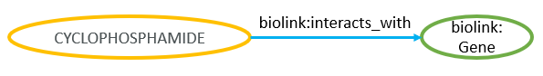
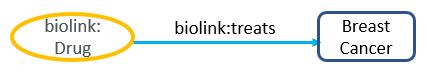
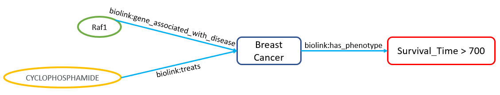
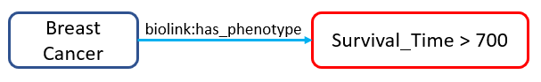
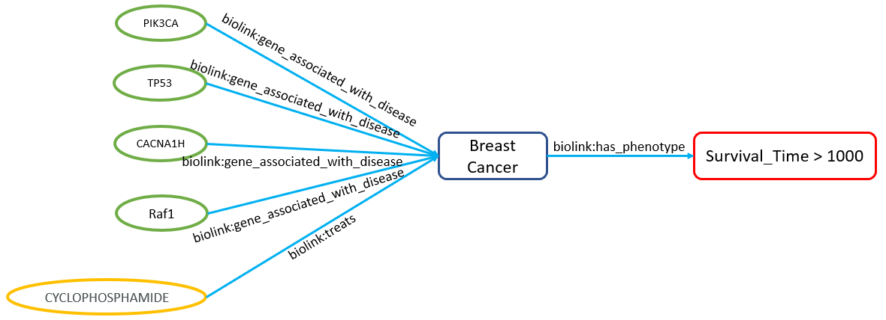

# Table of Contents
- [Introduction](#introduction)
- [Requirements](#requirements)
- [Installation](#installation)
- [Active Instances](#active-instances)
- [Quick Start](#quick-start)
- [Building Supported Queries](#building-supported-chp-queries)
  - [One Hop Queries](#one-hop-queries)
  - [Standard Queries](#standard-probabilistic-queries)
- [Build your own Instance for NCATS Deployment Pipeline](#build-your-own-instance-for-ncats-deployment-pipeline)
- [Contacting API Directly](#contacting-api-directly)
- [Other Notable Links](#other-notable-links)

# Introduction
The *chp_client* is a lightweight Python client for the NCATS Connections Hypothesis Provider (CHP). It is meant to be an easy-to-use wrapper utility to both run and build TRAPI queries the CHP web service will understand. Many of the CHP queries have been inspired by direct input from Translator ARAs and such ARAs may have their own dedicated CHP API client that returns results that they expect. However, there is also a default client that can handle generic CHP requests. 

# Requirements
  - Python >= 3.6
  - [bmt](https://pypi.org/project/bmt/)
  - [requests](https://pypi.python.org/pypi/requests)
  - submodules:
  
    1. [trapi_model](https://github.com/di2ag/trapi_model)
    2. [reasoner-validator](https://github.com/di2ag/reasoner-validator)
  
# Installation
``` 
pip3 install -r requirements.txt
python3 setup.py install 
```

# Active Instances
Our API Domain is:
```json
chp.thayer.dartmouth.edu
```
We also have subdomains accounted for particular disease types to narrow the scope for internal reasoning:
```json
breast.chp.thayer.dartmouth.edu
brain.chp.thayer.dartmouth.edu
lung.chp.thayer.dartmouth.edu
```
All endpoints have /query, /predicates, /curies and /versions functionality.

To access Trapi 1.0 please prepend your /query with /v1.0.

Example of main endpoint trapi 1.1 query
```json
chp.thayer.dartmouth.edu/query
```
Example of main endpoint trapi 1.0 query
```json
chp.thayer.dartmouth.edu/v1.0/query
```


# Quick Start
Once you have installed the CHP client, useage is as simple as:
``` python3
In [1]: from chp_client import get_client
In [2]: from chp_client.query import build_standard_query, build_wildcard_query, build_onehop_query
In [3]: default_client = get_client()
```

Now that you have an instance of the client, you can determine which query graph edge predicates are currently supported by CHP with:

```python3
In[4]: default_client.predicates()
{
  "biolink:Gene": {
    "biolink:Disease": [
      "biolink:gene_associated_with_condition"
    ],
    "biolink:Drug": [
      "biolink:interacts_with"
    ]
  },
  "biolink:Drug": {
    "biolink:Disease": [
      "biolink:treats"
    ],
    "biolink:Gene": [
      "biolink:interacts_with"
    ]
  },
  "biolink:Disease": {
    "biolink:PhenotypicFeature": [
      "biolink:has_phenotype"
    ]
  }
}
```

And you can check the current versions of our repos:

```python3
In [5]: versions = default_client.versions()
{
  "chp": "2.3.1",
  "chp_client": "1.1.3",
  "chp_data": "1.0.2",
  "pybkb": "2.0.0"
}
```

In the next section we will look at how to build CHP queries.

# Building Supported CHP Queries
As CHP is TRAPI compliant a large subset of queries can be built with a wide variety of structures. In order to scope the query building problem, we have currently limited the structures of queries that can be asked and have detailed their respective semantics. *Note: As the Translator and Biolink models develop we intend to ease these restrictions.*

## One Hop Queries
Our one hop structure allows associations to be built between genes and drugs, genes and diseases and drugs and disease where one node is a wildcard. Returned are nodes that contributed to our underlying probablistic semantics of P(survival_time > x | evidence).
### One Hop Drug to Gene Wildcard 


To build and query CHP for the above query:
```python
   In [6]: q = build_onehop_query(
       ..: q_object_category = 'gene',
       ..: q_subject='CHEMBL:CHEMBL88',
       ..: q_subject_category='drug',
       ..: trapi_version='1.1',
       ..: )
   In [7]: response = client.query(q.to_dict())
```
An example response from this type of query graph is below:
```json
"knowledge_graph": {
  "nodes": {
    "CHEMBL:CHEMBL88": {
      "name": "CYCLOPHOSPHAMIDE",
      "categories": [
        "biolink:Drug"
      ],
      "attributes": []
    },
    "ENSEMBL:ENSG00000141510": {
      "name": "TP53",
      "categories": [
        "biolink:Gene"
      ],
      "attributes": []
    },
    "ENSEMBL:ENSG00000129003": {
      "name": "VPS13C",
      "categories": [
        "biolink:Gene"
      ],
      "attributes": []
    },
    "ENSEMBL:ENSG00000155657": {
      "name": "TTN",
      "categories": [
        "biolink:Gene"
      ],
      "attributes": []
    },
    "ENSEMBL:ENSG00000181143": {
      "name": "MUC16",
      "categories": [
        "biolink:Gene"
      ],
      "attributes": []
    },
    "ENSEMBL:ENSG00000196632": {
      "name": "WNK3",
      "categories": [
        "biolink:Gene"
      ],
      "attributes": []
    },
    "ENSEMBL:ENSG00000127481": {
      "name": "UBR4",
      "categories": [
        "biolink:Gene"
      ],
      "attributes": []
    },
    "ENSEMBL:ENSG00000169855": {
      "name": "ROBO1",
      "categories": [
        "biolink:Gene"
      ],
      "attributes": []
    },
    "ENSEMBL:ENSG00000005810": {
      "name": "MYCBP2",
      "categories": [
        "biolink:Gene"
      ],
      "attributes": []
    },
    "ENSEMBL:ENSG00000118473": {
      "name": "SGIP1",
      "categories": [
        "biolink:Gene"
      ],
      "attributes": []
    },
    "ENSEMBL:ENSG00000198626": {
      "name": "RYR2",
      "categories": [
        "biolink:Gene"
      ],
      "attributes": []
    }
  },
  "edges": {
    "e0": {
      "predicate": "biolink:interacts_with",
      "relation": null,
      "subject": "CHEMBL:CHEMBL88",
      "object": "ENSEMBL:ENSG00000141510",
      "attributes": [
        {
          "attribute_type_id": "Contribution",
          "original_attribute_name": null,
          "value": -0.015305072994577756,
          "value_type_id": "biolink:has_evidence",
          "attribute_source": null,
          "value_url": null,
          "description": null
        }
      ]
    },
    "e1": {
      "predicate": "biolink:interacts_with",
      "relation": null,
      "subject": "CHEMBL:CHEMBL88",
      "object": "ENSEMBL:ENSG00000129003",
      "attributes": [
        {
          "attribute_type_id": "Contribution",
          "original_attribute_name": null,
          "value": -0.011937490158826738,
          "value_type_id": "biolink:has_evidence",
          "attribute_source": null,
          "value_url": null,
          "description": null
        }
      ]
    },
    "e2": {
      "predicate": "biolink:interacts_with",
      "relation": null,
      "subject": "CHEMBL:CHEMBL88",
      "object": "ENSEMBL:ENSG00000155657",
      "attributes": [
        {
          "attribute_type_id": "Contribution",
          "original_attribute_name": null,
          "value": -0.011265657498001666,
          "value_type_id": "biolink:has_evidence",
          "attribute_source": null,
          "value_url": null,
          "description": null
        }
      ]
    },
    "e3": {
      "predicate": "biolink:interacts_with",
      "relation": null,
      "subject": "CHEMBL:CHEMBL88",
      "object": "ENSEMBL:ENSG00000181143",
      "attributes": [
        {
          "attribute_type_id": "Contribution",
          "original_attribute_name": null,
          "value": -0.0107876150199956,
          "value_type_id": "biolink:has_evidence",
          "attribute_source": null,
          "value_url": null,
          "description": null
        }
      ]
    },
    "e4": {
      "predicate": "biolink:interacts_with",
      "relation": null,
      "subject": "CHEMBL:CHEMBL88",
      "object": "ENSEMBL:ENSG00000196632",
      "attributes": [
        {
          "attribute_type_id": "Contribution",
          "original_attribute_name": null,
          "value": -0.010529562080332809,
          "value_type_id": "biolink:has_evidence",
          "attribute_source": null,
          "value_url": null,
          "description": null
        }
      ]
    },
    "e5": {
      "predicate": "biolink:interacts_with",
      "relation": null,
      "subject": "CHEMBL:CHEMBL88",
      "object": "ENSEMBL:ENSG00000127481",
      "attributes": [
        {
          "attribute_type_id": "Contribution",
          "original_attribute_name": null,
          "value": -0.010210255955874721,
          "value_type_id": "biolink:has_evidence",
          "attribute_source": null,
          "value_url": null,
          "description": null
        }
      ]
    },
    "e6": {
      "predicate": "biolink:interacts_with",
      "relation": null,
      "subject": "CHEMBL:CHEMBL88",
      "object": "ENSEMBL:ENSG00000169855",
      "attributes": [
        {
          "attribute_type_id": "Contribution",
          "original_attribute_name": null,
          "value": -0.01018732959144447,
          "value_type_id": "biolink:has_evidence",
          "attribute_source": null,
          "value_url": null,
          "description": null
        }
      ]
    },
    "e7": {
      "predicate": "biolink:interacts_with",
      "relation": null,
      "subject": "CHEMBL:CHEMBL88",
      "object": "ENSEMBL:ENSG00000005810",
      "attributes": [
        {
          "attribute_type_id": "Contribution",
          "original_attribute_name": null,
          "value": -0.009817363716694328,
          "value_type_id": "biolink:has_evidence",
          "attribute_source": null,
          "value_url": null,
          "description": null
        }
      ]
    },
    "e8": {
      "predicate": "biolink:interacts_with",
      "relation": null,
      "subject": "CHEMBL:CHEMBL88",
      "object": "ENSEMBL:ENSG00000118473",
      "attributes": [
        {
          "attribute_type_id": "Contribution",
          "original_attribute_name": null,
          "value": -0.009675879792795597,
          "value_type_id": "biolink:has_evidence",
          "attribute_source": null,
          "value_url": null,
          "description": null
        }
      ]
    },
    "e9": {
      "predicate": "biolink:interacts_with",
      "relation": null,
      "subject": "CHEMBL:CHEMBL88",
      "object": "ENSEMBL:ENSG00000198626",
      "attributes": [
        {
          "attribute_type_id": "Contribution",
          "original_attribute_name": null,
          "value": 0.008687240281302784,
          "value_type_id": "biolink:has_evidence",
          "attribute_source": null,
          "value_url": null,
          "description": null
        }
      ]
    }
  }
}
```
#### Extracting the Statiscally Important Genes
CHP uses a method called Contributions Analysis to analyze gene importance and thereby rank genes. When the probability of the subgraph query (i.e. everything except the gene wildcards) is calculated, it carries with it a probabilistic mass. Contribution analysis tracks the amount of mass each component in our model contributed to the total mass (i.e. that final probability value of the query subgraph). As gene mutations play a significant role in our model, we are able to track each gene mutation's contribution to the total probabillistic mass, allowing us to yield our ranked gene results. The interpretation of these ranked genes should be that they are the genes that contributed most to supporting the given query.

The edge attribute displays the contribution for the wildcard gene nodes.

### One Hop Gene to Drug Wildcard


Similar to the previous query, we can find associations between drugs and genes where drugs is the wildcard.

```python
   In [8]: q = build_onehop_query(
       ..: q_object_category = 'gene',
       ..: q_subject='CHEMBL:CHEMBL88',
       ..: q_subject_category='drug',
       ..: trapi_version='1.1',
       ..: )
   In [9]: response = client.query(q.to_dict())
```

### One Hop Drug Wildcard to Disease



```python
   In [10]: q = build_onehop_query(
        ..: q_subject_category = 'disease',
        ..: q_subject='MONDO:0007254',
        ..: q_object_category='drug',
        ..: trapi_version='1.1',
        ..: )
   In [11]: response = client.query(q.to_dict())
```

## Standard Probabilistic Queries
### Query format
Our standard query is a straight probabilistic query of the form *P(Outcome | Gene Mutations, Disease, Therapeutics, ...)*. We can see a graphical representation of a query below:



Notice, that the CHP can handle multi-hop queries. We reason in the full contents of the query graph and return the appropriate response. In this case the respose will be a edge binding to the the disease to the phenotype in this query graph. Where the resultant calculated knowledge graph of this query graph will have a biolink:has_confidence_level attribute denoting the calculated probability for this query. We can build this query with the provided query module of the client with the following code:

```python
In [12]: from chp_client.query import build_query

In [13]: q = build_standard_query(
    ...: genes=['ENSEMBL:ENSG00000121879'],
    ...: drugs=['CHEMBL:CHEMBL88'],
    ...: disease='MONDO:0007254',
    ...: outcome='EFO:0000714',
    ...: outcome_name='survival_time',
    ...: outcome_op='>',
    ...: outcome_value=700,
    ...: trapi_version='1.1',
   )
   
In [14]: response = client.query(q.to_dict())
```

An example response from this type of query graph is below:

```json
{
  "message": {
    "query_graph": {
      "nodes": {
        "n0": {
          "ids": [
            "MONDO:0007254"
          ],
          "categories": [
            "biolink:Disease"
          ],
          "constraints": []
        },
        "n1": {
          "ids": [
            "ENSEMBL:ENSG00000121879"
          ],
          "categories": [
            "biolink:Gene"
          ],
          "constraints": []
        },
        "n2": {
          "ids": [
            "CHEMBL:CHEMBL88"
          ],
          "categories": [
            "biolink:Drug"
          ],
          "constraints": []
        },
        "n3": {
          "ids": [
            "EFO:0000714"
          ],
          "categories": [
            "biolink:PhenotypicFeature"
          ],
          "constraints": []
        }
      },
      "edges": {
        "e0": {
          "predicates": [
            "biolink:gene_associated_with_condition"
          ],
          "relation": null,
          "subject": "n1",
          "object": "n0",
          "constraints": []
        },
        "e1": {
          "predicates": [
            "biolink:treats"
          ],
          "relation": null,
          "subject": "n2",
          "object": "n0",
          "constraints": []
        },
        "e2": {
          "predicates": [
            "biolink:has_phenotype"
          ],
          "relation": null,
          "subject": "n0",
          "object": "n3",
          "constraints": [
            {
              "name": "survival_time",
              "id": "EFO:0000714",
              "operator": ">",
              "value": 700,
              "unit_id": null,
              "unit_name": null,
              "not": false
            }
          ]
        }
      }
    },
    "knowledge_graph": {
      "nodes": {
        "MONDO:0007254": {
          "name": "MONDO:0007254",
          "categories": [
            "biolink:Disease"
          ],
          "attributes": []
        },
        "ENSEMBL:ENSG00000121879": {
          "name": "PIK3CA",
          "categories": [
            "biolink:Gene"
          ],
          "attributes": []
        },
        "CHEMBL:CHEMBL88": {
          "name": "CYCLOPHOSPHAMIDE",
          "categories": [
            "biolink:Drug"
          ],
          "attributes": []
        },
        "EFO:0000714": {
          "name": "EFO:0000714",
          "categories": [
            "biolink:PhenotypicFeature"
          ],
          "attributes": []
        }
      },
      "edges": {
        "e0": {
          "predicate": "biolink:gene_associated_with_condition",
          "relation": null,
          "subject": "ENSEMBL:ENSG00000121879",
          "object": "MONDO:0007254",
          "attributes": []
        },
        "e1": {
          "predicate": "biolink:treats",
          "relation": null,
          "subject": "CHEMBL:CHEMBL88",
          "object": "MONDO:0007254",
          "attributes": []
        },
        "e2": {
          "predicate": "biolink:has_phenotype",
          "relation": null,
          "subject": "MONDO:0007254",
          "object": "EFO:0000714",
          "attributes": [
            {
              "attribute_type_id": "Probability of Survival",
              "original_attribute_name": null,
              "value": 0.6562500000000003,
              "value_type_id": "biolink:has_confidence_level",
              "attribute_source": null,
              "value_url": null,
              "description": null
            }
          ]
        }
      }
    },
    "results": [
      {
        "edge_bindings": {
          "e0": [
            {
              "id": "e0"
            }
          ],
          "e1": [
            {
              "id": "e1"
            }
          ],
          "e2": [
            {
              "id": "e2"
            }
          ]
        },
        "node_bindings": {
          "n0": [
            {
              "id": "MONDO:0007254"
            }
          ],
          "n1": [
            {
              "id": "ENSEMBL:ENSG00000121879"
            }
          ],
          "n2": [
            {
              "id": "CHEMBL:CHEMBL88"
            }
          ],
          "n3": [
            {
              "id": "EFO:0000714"
            }
          ]
        }
      }
    ]
  },
  "max_results": 10,
  "trapi_version": "1.1",
  "biolink_version": null,
  "pk": "e7634da0-e977-482a-b8ba-fc65044a1f39"

```

#### Extracting Query Probability
You can extract the probability of the query manually from the TRAPI response data from CHP, but we have also provided a helper method inside the client to assist in extracting this probability.

```python
In [15]: client.get_outcome_prob(response)
Out[16]: 0.6562500000000003
```

The interpretation of this probability is that ~ 65% of all patients in our dataset with a somatic mutation in RAF1 gene that took Cyclophosphamide survived for more than 700 days after initial diagnosis.

### Other Examples
#### No Evidence



```python
In [17]: q = build_standard_query(
    ...: disease='MONDO:0007254',
    ...: outcome='EFO:0000714',
    ...: outcome_name='survival_time',
    ...: outcome_op='>',
    ...: outcome_value=700,
    ...: trapi_version='1.1',
   )
```

#### All the evidence



```python
In [18]: q = build_standard_query(
    ...: genes=['ENSEMBL:ENSG00000121879', 'ENSEMBL:ENSG00000141510', 'ENSEMBL:ENSG00000196557', 'ENSEMBL:ENSG00000132155'],
    ...: drugs=['CHEMBL:CHEMBL88'],
    ...: disease='MONDO:0007254',
    ...: outcome='EFO:0000714',
    ...: outcome_name='survival_time',
    ...: outcome_op='>',
    ...: outcome_value=1000,
    ...: trapi_version='1.1',
   )
```

# Build your own Instance for NCATS Deployment Pipeline
```python
In [19]: # First git clone chp_api somewhere that you want
In [20]: git clone https:/github.com/NCATSTranslator/chp_api.git
In [21]: # Go into the chp_api directory and run docker-compose
In [22]: cd chp_api
In [23]: docker-compose -f docker-compose.prod.yml build 
In [24]: docker-compose -f docker-compose-prod.yml up -d
In [25]: docker-compose -f docker-compose.prod.yml exec web python3 manage.py makemigrations
In [26]: docker-compose -f docker-compose.prod.yml exec web python3 manage.py migrate --noinput
In [27]: docker-compose -f docker-compose.prod.yml exec web python3 manage.py collectstatic --no-input --clear
```

# Contacting API Directly

```python
In [28]: import requests
In [29]: import json
In [30]: # Display predicates
In [31]: r = requests.get('http://chp.thayer.dartmouth.edu/predicates/')
In [32]: json_formatted_str = json.dumps(json.loads(r.content), indent=2)
In [33]: # Display all available curies
In [34]: r = requests.get('http://chp.thayer.dartmouth.edu/curies/')
In [35]: json_formatted_str = json.dumps(json.loads(r.content), indent=2)
In [36]: # Query CHP
In [37]: r = requests.post('http://chp.thayer.dartmouth.edu/query/', json=payload)
In [38]: chp_res = json.dumps(json.loads(r.content), indent=2)


```

# Other Notable Links
* [CHP Roadmap](https://github.com/di2ag/Connections-Hypothesis-Provider-Roadmap)
* [CHP Wiki](https://github.com/NCATSTranslator/Translator-All/wiki/Connections-Hypothesis-Provider)
* [Our CHP Repo](https://github.com/di2ag/chp)
* [Our API Repo](https://github.com/di2ag/chp_api)
