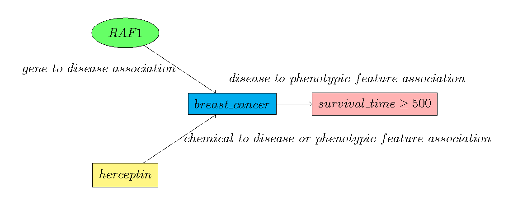

## Introduction
The *chp_client* is a lightweight Python client for the NCATS Connections Hypothesis Provider (CHP). It is meant to be an easy-to-use wrapper utility to both run and build TRAPI queries the CHP web service will understand. Many of the CHP queries have been inspired by direct input from Translator ARAs and such ARAs may have their own dedicated CHP API client that returns results that they expect. However, there is also a default client that can handle generic CHP requests. 

## Requirements
  - Python >= 3.6
  - [requests](https://pypi.python.org/pypi/requests)
  
### Optional libraries
  - [requests_cache](https://pypi.python.org/pypi/requests-cache) *(Allows user to setup of requests caching.)*

## Installation
### Option 1
``` python3 setup.py install ```
### Option 2
```pip3 install -e git+https://github.com/di2ag/chp_client```

## Quick Start
Once you have installed the CHP client, useage is as simple as:
``` python3
In[1]: from chp_client import get_client

In[2]: default_client = get_client()
```

Now that you have an instance of the client, you can determine which query graph edge predicates are currently supported by CHP with:

```python3
In[3]: default_client.predicates()
{
  "gene": {
    "disease": [
      "gene_to_disease_association"
    ]
  },
  "chemical_substance": {
    "disease": [
      "chemical_to_disease_or_phenotypic_feature_association"
    ]
  },
  "disease": {
    "phenotypic_feature": [
      "disease_to_phenotypic_feature_association"
    ]
  }
}
```

And you can check the supported curies by:

```python3
In[4]: default_client.curies()
{
  "chemical_substance": [
    {
      "name": "ZOLADEX",
      "curie": "CHEMBL:CHEMBL1201247"
    },
    {
      "name": "CYCLOPHOSPHAMIDE",
      "curie": "CHEMBL:CHEMBL88"
    }, ...
  ]
  "phenotypic_feature": [
    {
      "name": "survival_time",
      "curie": "EFO:0000714"
    }
  ],
  "disease": [
    {
      "name": "breast_cancer",
      "curie": "MONDO:0007254"
    }
  ],
  "gene": [
    {
      "name": "CLIP2",
      "curie": "ENSEMBL:ENSG00000106665"
    },
    {
      "name": "PI4KA",
      "curie": "ENSEMBL:ENSG00000241973"
    },
    {
      "name": "CELSR2",
      "curie": "ENSEMBL:ENSG00000143126"
    }, ...
  ]
}
```
This function will return a dictionary of supported biolink entities (NamedThings) that are supported by CHP along with a list of curies for each type. The list will include both our internal CHP name for the entity along with its associated curie for better human readability. *Note: When building query graphs only specify the appropriate curie. There is no need to also specify our internal name that we provide.*

Now that we know which curies and predicates are supported by CHP we can post a query to CHP via:

```python3
In[5]: default_client.query(q)
```
In the next section we will look at how to build CHP queries.

## Building Supported CHP Queries
As CHP is TRAPI compliant a large subset of queries can be built with a wide variety of structures. In order to scope the query building problem, we have currently limited the structures of queries that can be asked and have detailed their respective semantics. *Note: As the Translator and Biolink models develop we intend to ease these restrictions.*

### Standard Probablistic Query (One query, one result)
#### Single Gene Queries
Our standard query is a straight probabilistic query of the form *P(Outcome | Gene Mutations, Disease, Therapeutics, ...)*. We can see a graphical representation of a query below:



Notice, that the CHP is inherently a multi-hop knowledge provider. We can in the full contents of the query graph and return the appropriate response. In this case the respose will be a edge binding to the disease_to_phenotypic_feature_association in this query graph. Where the resultant calculated knowledge graph of this query graph will have a *has_confidence* attribute denoting the calculated probability for this query. The an example response from this type of query graph is below:

```json
{
  "message": {
    "query_graph": {
      "edges": [
        {
          "id": "e0",
          "type": "gene_to_disease_association",
          "source_id": "n0",
          "target_id": "n2"
        },
        {
          "id": "e1",
          "type": "chemical_to_disease_or_phenotypic_feature_association",
          "source_id": "n1",
          "target_id": "n2"
        },
        {
          "id": "e2",
          "type": "disease_to_phenotypic_feature_association",
          "source_id": "n2",
          "target_id": "n3",
          "properties": {
            "qualifier": ">=",
            "value": 500
          }
        }
      ],
      "nodes": [
        {
          "id": "n0",
          "type": "gene",
          "curie": "ENSEMBL:ENSG00000132155"
        },
        {
          "id": "n1",
          "type": "chemical_substance",
          "curie": "CHEMBL:CHEMBL88"
        },
        {
          "id": "n2",
          "type": "disease",
          "curie": "MONDO:0007254"
        },
        {
          "id": "n3",
          "type": "phenotypic_feature",
          "curie": "EFO:0000714"
        }
      ]
    },
    "knowledge_graph": {
      "edges": [
        {
          "id": "cff35aa2-3a95-4e84-aa33-18ef576025e8",
          "type": "gene_to_disease_association",
          "source_id": "7c89d32e-2a6e-4cbc-9ece-2ca07c6a458e",
          "target_id": "1f5fa86b-ffa7-437c-9033-74d17c3f4795"
        },
        {
          "id": "51cc7d6b-c63e-458a-b4f4-53c3a6210b05",
          "type": "chemical_to_disease_or_phenotypic_feature_association",
          "source_id": "298b0b61-7e43-4334-9516-898c10708019",
          "target_id": "1f5fa86b-ffa7-437c-9033-74d17c3f4795"
        },
        {
          "id": "08cf0382-a43f-4a5b-a556-7b934dc7eb36",
          "type": "disease_to_phenotypic_feature_association",
          "source_id": "1f5fa86b-ffa7-437c-9033-74d17c3f4795",
          "target_id": "4110a6b6-6178-4321-9c12-f4b253b2727c",
          "properties": {
            "qualifier": ">=",
            "value": 500
          },
          "has_confidence_level": 0.999718157375553
        }
      ],
      "nodes": [
        {
          "id": "7c89d32e-2a6e-4cbc-9ece-2ca07c6a458e",
          "type": "gene",
          "curie": "ENSEMBL:ENSG00000132155",
          "name": "RAF1"
        },
        {
          "id": "298b0b61-7e43-4334-9516-898c10708019",
          "type": "chemical_substance",
          "curie": "CHEMBL:CHEMBL88",
          "name": "CYTOXAN"
        },
        {
          "id": "1f5fa86b-ffa7-437c-9033-74d17c3f4795",
          "type": "disease",
          "curie": "MONDO:0007254"
        },
        {
          "id": "4110a6b6-6178-4321-9c12-f4b253b2727c",
          "type": "phenotypic_feature",
          "curie": "EFO:0000714"
        }
      ]
    },
    "results": {
      "node_bindings": [],
      "edge_bindings": [
        {
          "qg_id": "e2",
          "kg_id": "08cf0382-a43f-4a5b-a556-7b934dc7eb36"
        }
      ]
    }
  }
}
```
#### Multi-Gene Queries
As the CHP is inherenly multi-hop, we can easily add multiple genes to our query graph and calcuate the probability of a patient outcome in the presence of mutliple gene mutations. A sample query graph is below *(We have not graphed the edge labels for ease of view but they are there in the query graph)*:


A result from the CHP will again be a single edge binding as in the single gene case with the associated probability of the query in the *has_confidence* attribute. A sample json response from a multi-gene query is below:

```json
{
  "message": {
    "query_graph": {
      "edges": [
        {
          "id": "e0",
          "type": "gene_to_disease_association",
          "source_id": "n0",
          "target_id": "n3"
        },
        {
          "id": "e1",
          "type": "gene_to_disease_association",
          "source_id": "n1",
          "target_id": "n3"
        },
        {
          "id": "e2",
          "type": "chemical_to_disease_or_phenotypic_feature_association",
          "source_id": "n2",
          "target_id": "n3"
        },
        {
          "id": "e3",
          "type": "disease_to_phenotypic_feature_association",
          "source_id": "n3",
          "target_id": "n4",
          "properties": {
            "qualifier": ">=",
            "value": 500
          }
        }
      ],
      "nodes": [
        {
          "id": "n0",
          "type": "gene",
          "curie": "ENSEMBL:ENSG00000132155"
        },
        {
          "id": "n1",
          "type": "gene",
          "curie": "ENSEMBL:ENSG00000073803"
        },
        {
          "id": "n2",
          "type": "chemical_substance",
          "curie": "CHEMBL:CHEMBL88"
        },
        {
          "id": "n3",
          "type": "disease",
          "curie": "MONDO:0007254"
        },
        {
          "id": "n4",
          "type": "phenotypic_feature",
          "curie": "EFO:0000714"
        }
      ]
    },
    "knowledge_graph": {
      "edges": [
        {
          "id": "f85cc4f4-9ebd-4e4e-b54b-7de590dda657",
          "type": "gene_to_disease_association",
          "source_id": "329275a1-cb3d-4f97-9d7e-15bca23743dd",
          "target_id": "79490568-3a0e-46fe-bedf-34d2218fa262"
        },
        {
          "id": "cfe15445-e9c0-4cde-8fda-fd82e91609ac",
          "type": "gene_to_disease_association",
          "source_id": "13c34845-c6f9-4e72-a6d5-2b8bf4fe8366",
          "target_id": "79490568-3a0e-46fe-bedf-34d2218fa262"
        },
        {
          "id": "fa7f6cd6-583a-414e-aa75-afb2c23a504c",
          "type": "chemical_to_disease_or_phenotypic_feature_association",
          "source_id": "ce222293-80fb-4c43-a2b9-c244b1b09339",
          "target_id": "79490568-3a0e-46fe-bedf-34d2218fa262"
        },
        {
          "id": "e02e6f5d-a3de-4430-9dea-48d5f3695a45",
          "type": "disease_to_phenotypic_feature_association",
          "source_id": "79490568-3a0e-46fe-bedf-34d2218fa262",
          "target_id": "a1e328b3-195e-4162-8354-16567a5b234f",
          "properties": {
            "qualifier": ">=",
            "value": 500
          },
          "has_confidence_level": 0.9999998961622171
        }
      ],
      "nodes": [
        {
          "id": "329275a1-cb3d-4f97-9d7e-15bca23743dd",
          "type": "gene",
          "curie": "ENSEMBL:ENSG00000132155",
          "name": "RAF1"
        },
        {
          "id": "13c34845-c6f9-4e72-a6d5-2b8bf4fe8366",
          "type": "gene",
          "curie": "ENSEMBL:ENSG00000073803",
          "name": "MAP3K13"
        },
        {
          "id": "ce222293-80fb-4c43-a2b9-c244b1b09339",
          "type": "chemical_substance",
          "curie": "CHEMBL:CHEMBL88",
          "name": "CYTOXAN"
        },
        {
          "id": "79490568-3a0e-46fe-bedf-34d2218fa262",
          "type": "disease",
          "curie": "MONDO:0007254"
        },
        {
          "id": "a1e328b3-195e-4162-8354-16567a5b234f",
          "type": "phenotypic_feature",
          "curie": "EFO:0000714"
        }
      ]
    },
    "results": {
      "node_bindings": [],
      "edge_bindings": [
        {
          "qg_id": "e3",
          "kg_id": "e02e6f5d-a3de-4430-9dea-48d5f3695a45"
        }
      ]
    }
  }
}
```

### Gene Wildcard Query (One query, many results)
TODO: Contribution analysis ranked genes

### Drug Wildcard Query (One query, many results)
To come...


## CHP Query Semantics
TODO: Explain biolink edge semantics and node types

## API Documentation
TODO.
